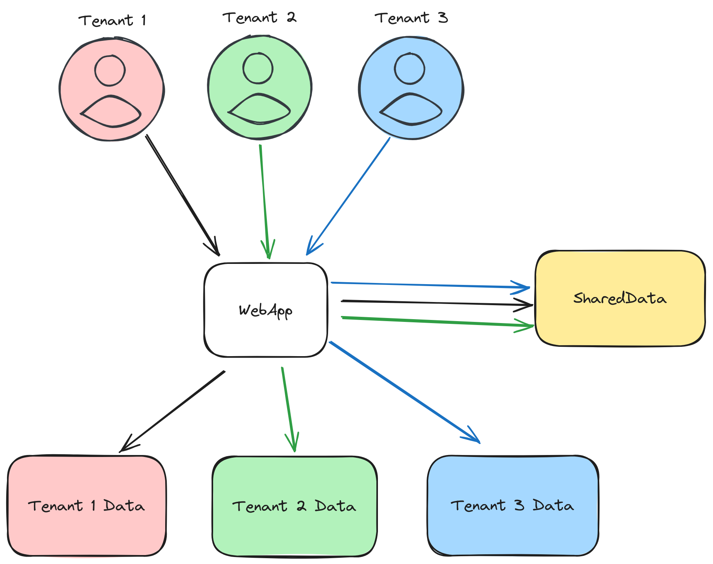

# Django Multitenancy



django-multitenancy is a python library for Django applications that enables multitenancy with physical tenant data isolation (separate database instance per tenant) in your web applications. 

Multitenancy is a software architecture where a single instance of an application serves multiple tenants, or clients, in a shared environment. In this model, tenants share the same application and underlying infrastructure, but their data is logically/physically isolated, allowing each tenant to operate as if they have their own dedicated instance. Typically, multitenancy is employed to optimize resource utilization and reduce operational costs by serving a large user base with a single, shared codebase and set of resources.

In the solution with a shared common database and separate database per tenant, a central database stores common data shared among all tenants, promoting resource efficiency, while each tenant has its own dedicated database for customized and isolated data management. This architecture provides a balance between shared resource benefits and individual tenant autonomy, making it well-suited for applications where tenants require varying levels of customization and data isolation. However, it introduces increased complexity in database management as each tenant's database needs separate administration.


## Table of Contents

- [Installation](#installation)
- [Usage](#usage)
  - [Configuring Multitenancy](#configuring-multitenancy)
  - [Defining Tenant-Specific Models](#defining-tenant-specific-models)
  - [Accessing Tenant-Specific Data](#accessing-tenant-specific-data)
  - [Example](#example)
- [Contributing](#contributing)
- [License](#license)

## Installation

To install the `django-multitenancy-plus` package, use the following pip command:

```bash
pip install django-multitenancy-plus
```

## Usage

### Defining Tenant-Specific Models

Create tenant app and add tenant model by inheriting from `django_multitenancy.mixins.TenantMixin`:

```python
from django_multitenancy.mixins import TenantMixin


class Tenant(TenantMixin):
    name = models.CharField(max_length=100, null=False)
```

Define tenant model in settings.py:
```python
TENANT_MODEL = "tenants.Tenant"
```

In your Django project's settings, add `tenants` to your `SHARED_APPS`:

```python
# data for this list of apps would exist in every database schema/database instance
SHARED_APPS = [
    "django.contrib.admin",
    "django.contrib.auth",
    "django.contrib.contenttypes",
    "django.contrib.sessions",
    "django.contrib.messages",
    "django.contrib.staticfiles",
    "tenants",
]

# data for this list of apps would exist in single database schema/database instance
TENANT_APPS = [
    "tenantapp",
]

# Application definition
INSTALLED_APPS = SHARED_APPS + [app for app in TENANT_APPS if app not in SHARED_APPS]
```

Include the `MultiTenantMiddleware` in your `MIDDLEWARE`:

```python
MIDDLEWARE = [
    # make it first
    "django_multitenancy.middleware.MultiTenantMiddleware",
    
    # ...
]
```

### Accessing Tenant-Specific Data

To access tenant-specific data, use the contextvar `TENANT_VAR`:

```python
from django.http import HttpResponse, JsonResponse
from django_multitenancy.helpers import get_tenant_model, TENANT_VAR


def get_tanent_model_view(request):
    model = get_tenant_model()
    html = f"<html><body><h1>{model.__name__}</h1><h2>{request}</h2></body></html>"
    return HttpResponse(html, content_type="text/html", status=200)


def get_tenant_var_view(request):
    html = f"tenant: {TENANT_VAR.get()}"
    return HttpResponse(html, content_type="text/html", status=200)


def tenant_api__get_tenant_id(request):
    tenant = TENANT_VAR.get()
    return JsonResponse({
        "tenant_id": tenant.id,
    })
```


For a more detailed example, check the [examples](examples/) directory in this repository.

## Contributing

We welcome contributions! Please follow our [contribution guidelines](CONTRIBUTING.md) to get started.

## License

This project is licensed under the MIT License - see the [LICENSE](LICENSE) file for details.
